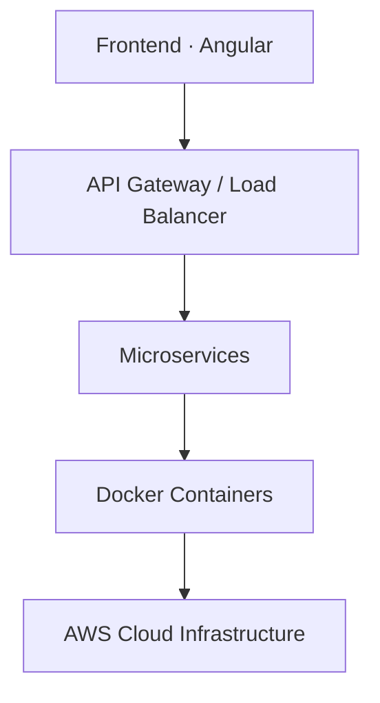

<div align="center">


# Hi, I'm Lahiru Sandaruwan 👋

**Building scalable web applications, cloud solutions, and intelligent systems from Sri Lanka 🇱🇰**

<p align="center">
  <a href="https://www.linkedin.com/in/lahiru-jayawardana/">
    
  </a>
  <a href="https://lahirujayawardana.netlify.app/">
    
  </a>
  <a href="mailto:lahirusandharuwan109@gmail.com">
    
  </a>
</p>


</div>

<br/>

## 🧑‍💻 About Me

I'm an **Associate Software Engineer** passionate about designing modern software using **Full-Stack Development, Cloud Computing, DevOps, and Artificial Intelligence**. I focus on building systems that are scalable, cloud-native, secure, and intelligent.

```yaml
name: Lahiru Sandaruwan
role: Associate Software Engineer
location: Sri Lanka 🇱🇰
focus: [Full-Stack, Cloud, DevOps, AI/ML]
currently_building: AI-powered DevOps Assistant
motto: Code • Cloud • AI • Innovation
```

<br/>

## 💼 Professional Experience

**Associate Software Engineer**

Working on enterprise-grade applications, where I:

- Develop scalable frontend applications with **Angular**
- Design **RESTful APIs** and backend services
- Build reusable, maintainable software components
- Implement **Role-Based Access Control (RBAC)**
- Improve application **security** and **performance**
- Work with **AWS** cloud infrastructure
- Create **CI/CD** automation workflows
- Containerize applications using **Docker**

<br/>

## 🛠️ Tech Stack

<table>
<tr>
<td valign="top" width="50%">

**Languages**


**Frontend**


**Backend**


</td>
<td valign="top" width="50%">

**Cloud & DevOps**


**Databases**


**AI / ML**


</td>
</tr>
</table>

<br/>

## 🚀 Featured Projects

| Project | Description | Status |
|---------|-------------|--------|
| ☁️ **Cloud Monitoring & Cost Optimization** | AWS-based monitoring with automated cost analysis and Lambda automation | ✅ Live |
| ⚙️ **AI-Powered DevOps Assistant** | Generates CI/CD workflows, analyzes deployment failures, and suggests infra improvements | 🔨 Building |
| 🏥 **Healthcare Management Platform** | Enterprise app with secure user management, RBAC, and real-time updates | ✅ Live |
| 🌱 **AI Agriculture Solution** | Crop disease detection, smart fertilizer recommendation, computer-vision monitoring | 🔭 Planned |

<br/>

## ☁️ Architecture I Work With



<br/>

## 📚 Currently Learning

`Machine Learning with Python` · `Deep Learning` · `TensorFlow & PyTorch` · `AWS ML Services` · `MLOps` · `Advanced Kubernetes` · `Cloud Architecture`

<br/>

## 📊 GitHub Analytics

<div align="center">


</div>

<br/>

## 🎯 Career Goals

- Build AI-powered software solutions
- Become a Cloud & DevOps specialist
- Master Machine Learning Engineering
- Develop scalable SaaS platforms
- Contribute to open-source projects

<br/>

## 🤝 Let's Connect

<p align="center">
  <a href="https://www.linkedin.com/in/lahiru-jayawardana/">
    
  </a>
  <a href="https://lahirujayawardana.netlify.app/">
    
  </a>
  <a href="mailto:lahirusandharuwan109@gmail.com">
    
  </a>
</p>

<div align="center">

### ⭐ Code • Cloud • AI • Innovation


</div>
