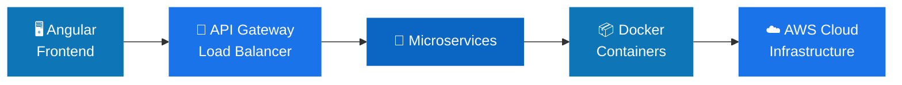

<!-- ============================================================= -->
<!--                        HERO BANNER                            -->
<!-- ============================================================= -->
<div align="center">


<a href="https://github.com/sandaruwan2000">

</a>

<br/>

<!-- Social badges -->
<p align="center">
  <a href="https://www.linkedin.com/in/lahiru-jayawardana/">
    
  </a>
  <a href="https://lahirujayawardana.netlify.app/">
    
  </a>
  <a href="mailto:lahirusandharuwan109@gmail.com">
    
  </a>
  
</p>


</div>

<br/>

<!-- ============================================================= -->
<!--                          ABOUT                                -->
<!-- ============================================================= -->
## 👨‍💻 About Me


> *Crafting **scalable, cloud-native, and intelligent** software from Sri Lanka* 🇱🇰

Hi! I'm an **Associate Software Engineer** who loves turning complex problems into elegant, well-architected systems. My work lives at the intersection of **Full-Stack Development**, **Cloud & DevOps**, and **Artificial Intelligence**.

- 🔭 &nbsp;Currently building an **AI-Powered DevOps Assistant**
- 🌱 &nbsp;Deepening my skills in **Machine Learning, MLOps & Kubernetes**
- 💡 &nbsp;I care about **clean code, security, and performance**
- 🎯 &nbsp;Goal: engineer **intelligent SaaS platforms** that scale
- ⚡ &nbsp;Fun fact: I believe great systems feel *invisible*

```yaml
Lahiru Sandaruwan:
  role:      "Associate Software Engineer"
  location:  "Sri Lanka 🇱🇰"
  focus:     ["Full-Stack", "Cloud", "DevOps", "AI/ML"]
  building:  "AI-Powered DevOps Assistant"
  motto:     "Code · Cloud · AI · Innovation"
```

<br clear="right"/>


<!-- ============================================================= -->
<!--                        EXPERIENCE                             -->
<!-- ============================================================= -->
## 💼 Professional Experience

<table>
<tr><td>

### 🔹 Associate Software Engineer

Building enterprise-grade applications end to end:

<table>
<tr>
<td>✅ Angular frontends</td>
<td>✅ RESTful APIs</td>
<td>✅ Reusable components</td>
</tr>
<tr>
<td>✅ RBAC security</td>
<td>✅ Performance tuning</td>
<td>✅ AWS infrastructure</td>
</tr>
<tr>
<td>✅ CI/CD automation</td>
<td>✅ Docker containers</td>
<td>✅ Microservices</td>
</tr>
</table>

</td></tr>
</table>

<br/>

<!-- ============================================================= -->
<!--                        TECH STACK                             -->
<!-- ============================================================= -->
## 🛠️ Tech Stack

<div align="center">

<table>
<tr>
<td align="center" width="50%">

**⌨️ &nbsp; Languages**
<br/><br/>


<br/><br/>

**🎨 &nbsp; Frontend**
<br/><br/>


<br/><br/>

**⚙️ &nbsp; Backend**
<br/><br/>


</td>
<td align="center" width="50%">

**☁️ &nbsp; Cloud & DevOps**
<br/><br/>


<br/><br/>

**🗄️ &nbsp; Databases**
<br/><br/>


<br/><br/>

**🤖 &nbsp; AI / ML**
<br/><br/>


</td>
</tr>
</table>

</div>


<!-- ============================================================= -->
<!--   FEATURED PROJECTS  (hidden — uncomment the block below      -->
<!--   to show it again)                                           -->
<!-- ============================================================= -->
<!--
## 🚀 Featured Projects

<table>
<tr>
<td width="50%" valign="top">

### ☁️ Cloud Monitoring & Cost Optimization
AWS-based monitoring with automated cost analysis and Lambda-driven automation.

`AWS` &nbsp;`Lambda` &nbsp;`CloudWatch`


</td>
<td width="50%" valign="top">

### ⚙️ AI-Powered DevOps Assistant
Generates CI/CD workflows, analyzes deployment failures, and suggests infra improvements.

`AI` &nbsp;`DevOps` &nbsp;`Automation`


</td>
</tr>
<tr>
<td width="50%" valign="top">

### 🏥 Healthcare Management Platform
Enterprise app with secure user management, RBAC, and real-time system updates.

`Angular` &nbsp;`Spring` &nbsp;`RBAC`


</td>
<td width="50%" valign="top">

### 🌱 AI Agriculture Solution
Crop disease detection, smart fertilizer recommendation, and computer-vision monitoring.

`Computer Vision` &nbsp;`ML` &nbsp;`IoT`


</td>
</tr>
</table>

<br/>
-->

<!-- ============================================================= -->
<!--                       ARCHITECTURE                            -->
<!-- ============================================================= -->
## 🏗️ Architecture I Build




<!-- ============================================================= -->
<!--                      GITHUB STATS                             -->
<!-- ============================================================= -->
## 📊 GitHub Analytics

<div align="center">


<br/>


<br/>


<br/>


</div>


<!-- ============================================================= -->
<!--                          GOALS                                -->
<!-- ============================================================= -->
## 🎯 Career Goals

<div align="center">

| 🤖 AI-Powered Solutions | ☁️ Cloud & DevOps Specialist | 🧠 ML Engineering |
|:---:|:---:|:---:|
| **🏗️ Scalable SaaS Platforms** | **🌍 Open-Source Contribution** | **🚀 Lifelong Learning** |

</div>

<br/>

<!-- ============================================================= -->
<!--                         QUOTE                                 -->
<!-- ============================================================= -->
<div align="center">


</div>

<br/>

<!-- ============================================================= -->
<!--                         CONNECT                               -->
<!-- ============================================================= -->
<div align="center">

## 🤝 Let's Build Something Great

<a href="https://www.linkedin.com/in/lahiru-jayawardana/">
  
</a>
<a href="https://lahirujayawardana.netlify.app/">
  
</a>
<a href="mailto:lahirusandharuwan109@gmail.com">
  
</a>

<br/><br/>

<i>⭐ Code · Cloud · AI · Innovation ⭐</i>

<br/>


</div>
