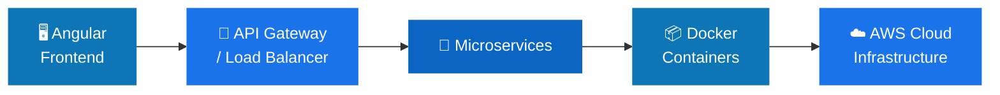

<!-- ========================= HEADER BANNER ========================= -->
<div align="center">


<br/>

<p align="center">
  <a href="https://www.linkedin.com/in/lahiru-jayawardana/">
    
  </a>
  <a href="https://lahirujayawardana.netlify.app/">
    
  </a>
  <a href="mailto:lahirusandharuwan109@gmail.com">
    
  </a>
  
</p>

</div>

<br/>

<!-- ========================= ABOUT ========================= -->


## &nbsp;About Me

> Crafting **scalable, cloud-native, and intelligent** software from Sri Lanka 🇱🇰

I'm an **Associate Software Engineer** who loves turning complex problems into elegant systems. My work sits at the intersection of **Full-Stack Development**, **Cloud & DevOps**, and **Artificial Intelligence** — building products that are secure, high-performance, and built to scale.

```yaml
Lahiru Sandaruwan:
  role:      "Associate Software Engineer"
  location:  "Sri Lanka 🇱🇰"
  focus:     ["Full-Stack", "Cloud", "DevOps", "AI/ML"]
  building:  "AI-Powered DevOps Assistant"
  learning:  "Machine Learning • MLOps • Kubernetes"
  motto:     "Code • Cloud • AI • Innovation"
```

<br/>

<!-- ========================= EXPERIENCE ========================= -->


## &nbsp;Professional Experience

<table>
<tr><td>

**🔹 Associate Software Engineer**

Building enterprise-grade applications, where I:

`Angular Frontends` &nbsp; `RESTful APIs` &nbsp; `Reusable Components` &nbsp; `RBAC Security`
`Performance Tuning` &nbsp; `AWS Infrastructure` &nbsp; `CI/CD Automation` &nbsp; `Docker`

</td></tr>
</table>

<br/>

<!-- ========================= TECH STACK ========================= -->


## &nbsp;Tech Stack

<div align="center">

<table>
<tr>
<td align="center" width="50%">

**⌨️ Languages**
<br/>


**🎨 Frontend**
<br/>


**⚙️ Backend**
<br/>


</td>
<td align="center" width="50%">

**☁️ Cloud & DevOps**
<br/>


**🗄️ Databases**
<br/>


**🤖 AI / ML**
<br/>


</td>
</tr>
</table>

</div>

<br/>

<!-- ========================= PROJECTS ========================= -->


## &nbsp;Featured Projects

<table>
<tr>
<td width="50%" valign="top">

### ☁️ Cloud Monitoring & Cost Optimization
AWS-based monitoring with automated cost analysis and Lambda-driven automation.

`AWS` `Lambda` `CloudWatch`


</td>
<td width="50%" valign="top">

### ⚙️ AI-Powered DevOps Assistant
Generates CI/CD workflows, analyzes deployment failures, and suggests infra improvements.

`AI` `DevOps` `Automation`


</td>
</tr>
<tr>
<td width="50%" valign="top">

### 🏥 Healthcare Management Platform
Enterprise app with secure user management, RBAC, and real-time system updates.

`Angular` `Spring` `RBAC`


</td>
<td width="50%" valign="top">

### 🌱 AI Agriculture Solution
Crop disease detection, smart fertilizer recommendation, and computer-vision monitoring.

`Computer Vision` `ML` `IoT`


</td>
</tr>
</table>

<br/>

<!-- ========================= ARCHITECTURE ========================= -->


## &nbsp;Architecture I Build



<br/>

<!-- ========================= GITHUB STATS ========================= -->


## &nbsp;GitHub Analytics

<div align="center">


<br/>


<br/>


</div>

<br/>

<!-- ========================= GOALS ========================= -->


## &nbsp;Career Goals

<div align="center">

`🤖 AI-Powered Solutions` &nbsp; `☁️ Cloud & DevOps Specialist` &nbsp; `🧠 ML Engineering`
<br/>
`🏗️ Scalable SaaS Platforms` &nbsp; `🌍 Open-Source Contribution`

</div>

<br/>

<!-- ========================= CONNECT ========================= -->
<div align="center">

## 🤝 Let's Build Something Great

<a href="https://www.linkedin.com/in/lahiru-jayawardana/">
  
</a>
<a href="https://lahirujayawardana.netlify.app/">
  
</a>
<a href="mailto:lahirusandharuwan109@gmail.com">
  
</a>

<br/><br/>

<i>⭐ Code • Cloud • AI • Innovation ⭐</i>


</div>
